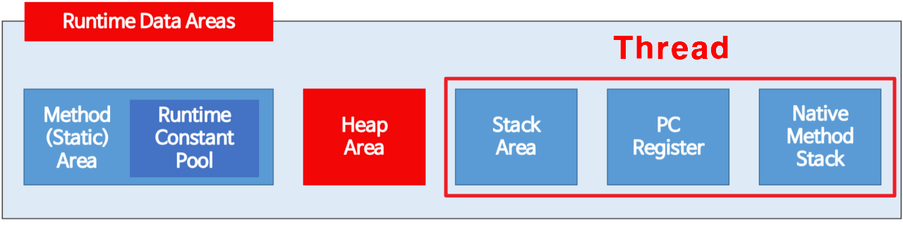

# jvm (enzo)

### JVM 동작 방식

 

<figure><figcaption></figcaption></figure>

1. 자바 컴파일러(javac)가 자바 소스코드(.java)를 바이트코드(.class)로 컴파일 합니다.
2. 클래스 로드를 통해서 다음과 같은 과정을 거칩니다
   1. 로딩 : 클래스를 읽어오는 과정 .class 파일을 가져와서 jvm의 메서드 영역에 배치합니다. 이 영역에는 코드, 메타 데이터, static 변수등이 포함되어 있습니다.
   2. 링크 : 레퍼런스를 읽는 과정 검증, 준비, 해석의 세부 단계로 나뉩니다 검증 : 바이트 코드가 안전한지 확인합니다 준비: 클래스 또는 인터페이스에 필요한 메모리를 할당하고, 정적변수를 기본값으로 초기화 합니다 해석: 심볼릭 메모리 참조를 직접 참조로 변환합니다
   3. 초기화 static 변수가 선언된 값으로 초기화 되고, static 블록이 실행됩니다.
3. JVM이 .class 파일을 로드하고, 연결 및 초기화 후에 실행 엔진을 통해 실행됩니다. 해당 데이터는 런타임 데이터 영역에 저장됩니다. JVM은 힙 영역에서 객체의 생성과 소멸을 관리하며, 가비지 컬렉션을 통해 사용되지 않는 메모리를 정리하고, 스택 영역에서 메서드 호출을 관리합니다.

### 실행 엔진

실행 엔진은 기본적으로 인터프리터와 JIT(Just In-Time) 컴파일러를 포함하고 있습니다.

* 인터프리터: 바이트 코드를 한 줄씩 읽어서 실행합니다. 그러나 같은 메서드를 반복적으로 실행해야 할 경우, 이는 성능 저하를 초래할 수 있습니다.
* JIT 컴파일러: 이러한 성능 저하를 해결하기 위해 JIT 컴파일러가 사용됩니다. JIT 컴파일러는 반복적으로 실행되는 코드를 발견하면 해당 코드를 기계어로 변환(컴파일)하여 성능을 개선합니다.

### 런타임 데이터 영역

 

<figure><figcaption></figcaption></figure>

실행 엔진이 바이트 코드를 처리하는 동안, 데이터는 JVM의 여러 메모리 영역에 저장되거나 옮겨집니다.

* 메서드 영역(Method Area): 이 영역은 클래스 수준의 정보(클래스 이름, 부모 클래스 이름, 메서드와 변수 등)를 저장합니다.
* 힙 영역(Heap Area): JVM이 관리하는 모든 객체는 이 힙 영역에 할당됩니다. 가비지 컬렉터는 주기적으로 이 영역을 검사하여 사용되지 않는 객체를 삭제합니다.
* 스택 영역(Stack Area): 각 스레드에 대한 메서드 호출과 로컬 변수는 여기에 저장됩니다. 각 메서드 호출에 대해 별도의 스택 프레임이 생성되며, 메서드 호출이 완료되면 해당 스택 프레임은 파괴됩니다.
* PC 레지스터(PC Registers): 각 스레드에 대해 별도의 PC 레지스터가 있으며, 현재 실행 중인 명령의 주소를 가지고 있습니다.
* 네이티브 메서드 스택(Native Method Stack): 네이티브 메서드의 정보를 저장하는 데 사용됩니다.

### 제어 및 실행 보조

* **쓰레드 동기화(Thread Synchronization)**: 런타임 환경에서는 여러 스레드가 동시에 실행될 수 있습니다. 이런 경우, 스레드 동기화가 중요한 이슈가 됩니다. JVM은 각 스레드에 대해 별도의 스택 영역과 PC 레지스터를 유지함으로써 스레드 간의 동기화를 관리합니다.
* **네이티브 메서드 인터페이스(Native Method Interface, JNI)**: JVM은 Java로 작성된 코드 뿐만 아니라 네이티브 메서드라 불리는 특정 플랫폼에 종속적인 메서드도 호출할 수 있습니다. JNI를 통해 이러한 네이티브 메서드를 실행할 수 있습니다.
* **가비지 컬렉션(Garbage Collection)**: JVM은 가비지 컬렉션을 통해 동적으로 할당된 메모리를 관리합니다. 프로그램이 더 이상 사용하지 않는 객체를 자동으로 회수하여 메모리를 재활용하며, 이로 인해 개발자는 메모리 관리에 신경 쓰지 않아도 됩니다.

### 힙 영역의 변천사

 

<figure><figcaption></figcaption></figure>

힙 영역에서 메모리를 회수 및 재활용을 자동으로 관리합니다.

힙영역은 다음과 같습니다.

1. Young Generation : 생성된지 얼마 안된 객체 저장소
2. Old Generation : 생성된지 어느 정도 된 객체 저장소
3. Permanent Generation → Metaspace (Java 8 이후로 변경) : 클래스 메타 데이터 저장 영역

**저장 영역의 변경 이유**

Permanent Generation은 여러 문제점을 가지고 있었으며, 가장 큰 문제는 이 영역이 고정 크기라는 점이었습니다. 즉, JVM 시작 시에 이 영역의 크기가 결정되고, 실행 중에 크기를 변경할 수 없었습니다. 이로 인해 OutOfMemoryError가 발생하는 경우가 많았습니다. 이러한 문제점을 해결하기 위해 Java 8에서는 Permanent Generation을 제거하고 Metaspace를 도입했습니다. Metaspace는 기본적으로 클래스 메타데이터를 저장하지만, 이 영역은 물리적 메모리에 제한을 받지 않고 필요에 따라 동적으로 확장됩니다.

### 클래스 메타 데이터

클래스 메타 데이터는 두 영역으로 저장됩니다.

**메서드 영역(Method Area)**

메서드 영역은 클래스 수준의 정보를 저장합니다. 메서드 영역에 저장되는 정보는 다음과 같습니다

* 클래스 이름
* 클래스와 인터페이스의 접근 지정자
* 클래스와 인터페이스의 직접 상위 클래스와 인터페이스
* 이 클래스 또는 인터페이스가 final인지 여부, 추상 클래스인지 여부 등의 플래그
* 이 클래스의 필드와 메서드(정적 또는 인스턴스)

이는 각 클래스 및 인터페이스에 대한 정적 메타데이터를 포함하는 것으로 볼 수 있습니다.

**Metaspace**

클래스 메타데이터의 일부를 메모리의 네이티브 영역에 저장합니다. Metaspace에 저장되는 정보는 다음과 같습니다

* 런타임 상수 풀
* 필드 및 메서드 데이터
* 메서드와 생성자의 바이트 코드
* 클래스 로더에 의해 로드된 클래스의 메타데이터

따라서 Metaspace는 클래스와 메서드, 그리고 그들이 실행되는 런타임 환경에 대한 더 동적이고 구체적인 정보를 저장합니다.

출처

[https://www.inflearn.com/course/the-java-code-manipulation/dashboard](https://www.inflearn.com/course/the-java-code-manipulation/dashboard)

[https://lob-dev.tistory.com/82](https://lob-dev.tistory.com/82)

나눠보고 싶은 이야기

* method area와 heap의 permgen 영역은 나눈 이유는 무엇일까?
* 컴파일러와 인터프리터의 장단점은?
  * 최근 언어의 변천사?
* jit 컴파일러는 어떻게 동작하는지 궁금하다.
